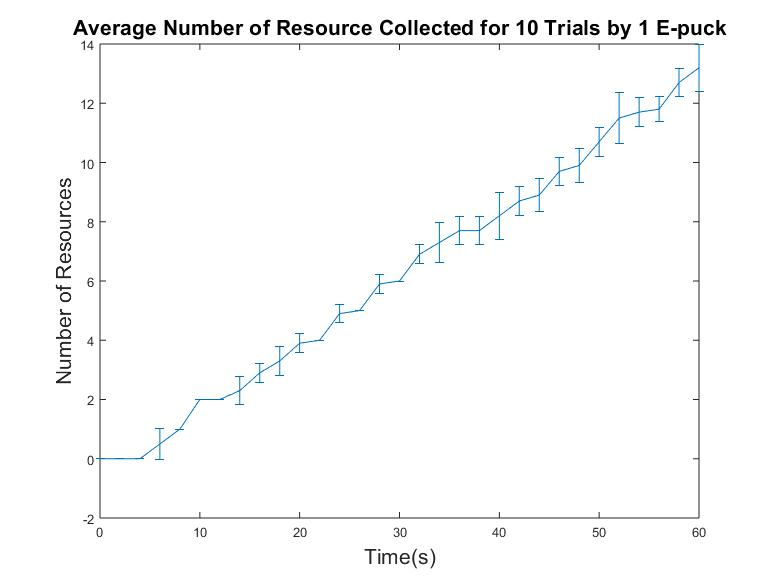
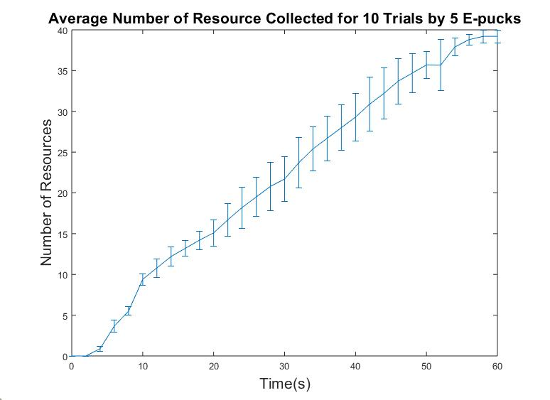

# ACS6121-Robotics-and-Autonomous-Systems
This is project is an assignment I completed as part of my Master degree with the Automatic Control and System Engineering Department at the University of Sheffield.

# Overview
The task is to design a control strategy for e-puck robots that do the following:  
● explore the given environment to collect resources ( foraging );  
● while foraging, avoid collisions between robots and with the environment boundary.

For an object to be collected, a robot's centre must be within 5 cm of the object's centre. There won't be
any collisions between the robot and the object.  

For the evaluation of this task, two foraging scenarios will be considered:
1. with a single robot ;
2. with a group of 5 robots (all with an identical controller).
  
The controller used for both scenarios MUST be the same.
To assess the foraging performance of the strategy, it is expected to conduct 10 trials per scenario.
Each trial should last 60 seconds of simulation time (note that the actual time that elapses on the
watch/computer may be different.). 
The simulation environment is shown in below.

The simulations will be made using V-REP. The scenes can be found in the scenes folder.The velocity argument is bounded by [-6.24, 6.24].The sensors available on the e-puck platform (e.g. camera, proximity) were used. 
Each e-puck explores the environment in a circular motion looking for resources to gather. When the e-puck identifies a resource, it navigates towards the resource and collects it. If the e-puck identifies more than one resource, it moves towards the closest resource and collects it. The circular motion of the e-puck enables it to scan all areas of the environment with its camera for resources. 
Additionally, each e-puck avoids collision with the walls and other e-pucks. When an e-puck detects a wall or another object in front of it, it turns around. Figure 1 is the graphical representation of the control strategy for the e-puck. 

# Results
To obtain the results, the number of collected resources was stored in a text file after every 2 seconds for each simulation time of 60 seconds. After conducting 10 trials each for a single e-puck and 5 e-pucks in the same environment, the mean the standard deviation for each time instance were calculated for the 2 scenarios. The results obtained from the simulation the single e-puck and 5 e-pucks are shown below. 

One Epuck

Five Epucks

Both figures represent the average number of resources collected over time, with the error bars showing the standard deviation of the number of collected resources for each time instance.  

The results show that the control strategy was very efficient in undertaking the foraging task. For the single e-puck, about 33% of the resource we collected. Furthermore, for the 5-robot simulation and an average of 98% of the resource were collected per simulation.
