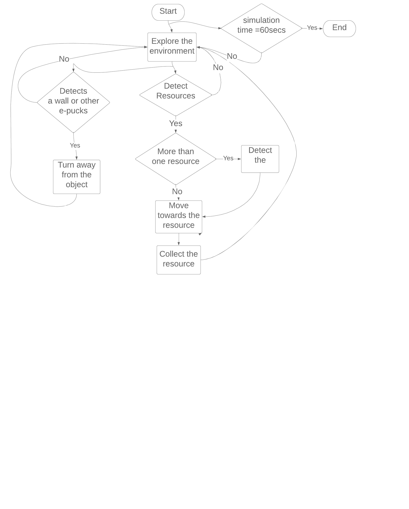

Each e-puck explores the environment in a circular motion looking for resources to gather. When the e-puck identifies a resource, it navigates towards the resource and collects it. If the e-puck identifies more than one resource, it moves towards the closest resource and collects it. The circular motion of the e-puck enables it to scan all areas of the environment with its camera for resources. 
Additionally, each e-puck avoids collision with the walls and other e-pucks. When an e-puck detects a wall or another object in front of it, it turns around. Figure 1 is the graphical representation of the control strategy for the e-puck. 

